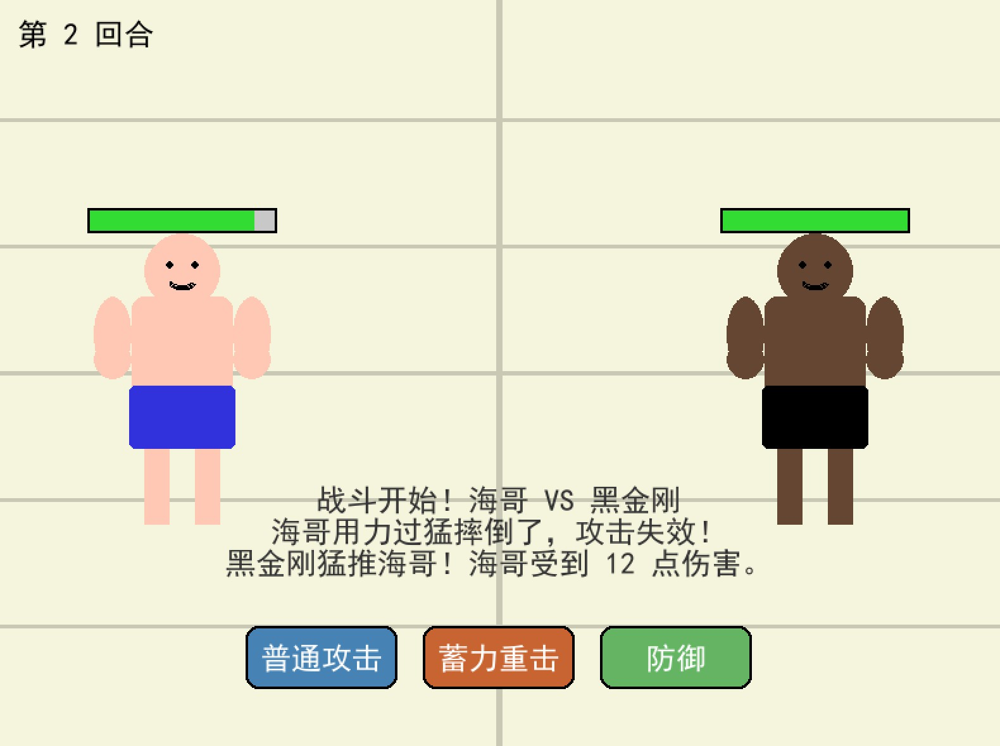

# 🎮 海哥大战黑金刚 (Brother Hai vs. Black King Kong)

> 一个基于 Python 和 Pygame 开发的魔性搞笑回合制对战游戏。  
> A humorous turn-based fighting game developed with Python & Pygame.





## 📖 游戏简介 (Introduction)

欢迎来到《海哥大战黑金刚》！这是一款无需复杂操作、画风清奇的单机回合制格斗游戏。

玩家将扮演身穿经典蓝裤衩的平民英雄**“海哥”**，在自家榻榻米上迎战宿敌**“黑金刚”**。游戏没有复杂的连招表，只有纯粹的心理博弈和运气比拼。是稳扎稳打，还是搏命一击？全看你的选择！

## 🕹️ 游戏规则 (Game Rules)

本游戏采用 **1V1 回合制** 战斗模式。海哥（玩家）与黑金刚（AI）轮流行动。

### 🎯 胜利条件
*   **胜利**：将对手的 HP（生命值）归零。
*   **失败**：海哥的 HP 归零。

### ⚔️ 技能说明

轮到你的回合时，你可以从以下三个指令中选择一个：

| 技能图标 | 技能名称 | 命中率 | 伤害 | 描述 |
| :---: | :--- | :---: | :---: | :--- |
| 👊 | **普通攻击** (Normal) | **95%** (极高) | 中等 (10-15) | 稳扎稳打，使用王八拳痛击敌人，几乎不会失手。 |
| 💥 | **蓄力重击** (Heavy) | **70%** (较低) | **高 (20-30)** | 高风险高回报的泰山压顶！打中就是重创，打不中就是自己摔倒。 |
| 🛡️ | **防御** (Defend) | - | - | 抱头蹲防。本回合不攻击，但受到的伤害 **减半**。 |

### 🤖 敌方 AI
黑金刚并非只会挨打的沙袋。他会思考（约 1 秒延迟），并随机使用普通攻击、野蛮冲撞（重击）或防御。请时刻注意血量！

---

## 🚀 如何游玩 (How to Play)

### 方式一：下载 EXE 直接运行 (Windows)
如果你不想安装 Python 环境，可以直接下载打包好的程序：

1. 点击右侧的 [Releases](https://github.com/JANZeee/BrotherHai-VS-BlackKingKong/releases/tag/new-game) 页面。
2. 下载 `海哥大战黑金刚.exe`。
3. 双击即可运行，畅玩游戏！

### 方法二：通过源码运行 (Developers)
如果你是开发者，想查看源码或进行修改：

1. **克隆仓库**
   ```bash
   git clone https://github.com/JANZeee/BrotherHai-VS-BlackKingKong.git
   cd BrotherHai-VS-BlackKingKong

2. **运行游戏**
   ```bash
   python main.py

## 🛠️ 技术栈 (Tech Stack)
* **语言**: Python 3
* **引擎**: Pygame (用于图形绘制和窗口管理)
* **打包**: PyInstaller (用于生成 exe 可执行文件)

## 🤝 贡献 (Contributing)
如果你有更有趣的点子（比如增加新的技能、新的角色皮肤），欢迎 Fork 本仓库并提交 Pull Request！
